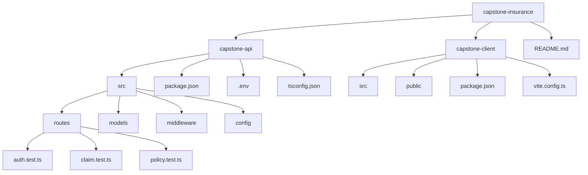

# Capstone Insurance Project

This project is a full-stack insurance application with a Node.js + Express API and a React + Vite client. It includes authentication, policy management, claim workflows, seeded demo data, and Vitest route tests.

## Prerequisites

Before you start, make sure the following are installed on your machine:

- Node.js 18 or newer
- npm
- MongoDB running locally or via Docker
- Git
- A terminal such as bash, zsh, or PowerShell

Optional but helpful:

- VS Code
- MongoDB Compass
- Postman or curl for API testing

## Project structure



## Step-by-step setup

1. Open a terminal and go to the project folder:

```bash
cd /path/to/capstone-insurance
```

2. Install the API dependencies:

```bash
cd capstone-api
npm install
```

3. Install the client dependencies:

```bash
cd ../capstone-client
npm install
```

4. Start MongoDB locally.

If MongoDB is installed locally, make sure the service is running:

```bash
mongod
```

If you use Docker for MongoDB, you can start a container with something like:

```bash
docker run -d -p 27017:27017 --name capstone-mongo mongo:latest
```

5. Confirm the API environment file is present and contains the correct local database URL:

```bash
cd ../capstone-api
cat .env
```

Expected values:

```env
PORT=4000
MONGODB_URI=mongodb://localhost:27017/policy-claims
```

## Seed the database

The API includes a seed script to load sample users, policies, and claims.

Run:

```bash
cd capstone-api
npm run seed
```

This creates default records so the app has usable demo data.

## Run the development servers

Open two terminal windows.

### Terminal 1: Start the API

```bash
cd capstone-insurance/capstone-api
npm run dev:tsx
```

This starts the Express API with TypeScript hot reload. The server should run on:

- http://localhost:4000

You can check the health endpoint:

```bash
curl http://localhost:4000/api/health
```

### Terminal 2: Start the client

```bash
cd capstone-insurance/capstone-client
npm run dev
```

This starts the Vite frontend. The app is usually available at:

- http://localhost:5173

## How the test files work

The project includes route tests in files such as:

- `capstone-api/src/routes/auth.test.ts`
- `capstone-api/src/routes/claim.test.ts`
- `capstone-api/src/routes/policy.test.ts`

These are Vitest test files. They use `describe`, `it`, and `expect` and send HTTP requests with `supertest` against an Express app.

Example pattern:

```ts
import request from "supertest";
import { describe, it, expect } from "vitest";

describe("Auth routes", () => {
  it("registers a user", async () => {
    const response = await request(app).post("/api/auth/register").send({
      name: "Jane Doe",
      email: "jane@example.com",
      password: "password123",
    });

    expect(response.status).toBe(201);
  });
});
```

Why they matter:

- They check route behavior without needing the browser.
- They validate status codes, returned JSON, validation errors, and auth behavior.
- They help catch regressions when you change route logic.

## Run the tests

From the API folder:

```bash
cd capstone-insurance/capstone-api
npx vitest run
```

Run a single file:

```bash
cd capstone-insurance/capstone-api
npx vitest run src/routes/auth.test.ts
```

Run in watch mode while developing:

```bash
cd capstone-insurance/capstone-api
npx vitest
```

Note: this project does not currently expose a working `npm test` script in the API package.json, so the Vitest CLI is the recommended command.

## Common login credentials

After seeding the database, you can log in with the default demo account:

```text
Email: admin@example.com
Password: Password123!
```

## Useful commands summary

```bash
# API install
cd capstone-insurance/capstone-api
npm install

# Client install
cd ../capstone-client
npm install

# Seed data
cd ../capstone-api
npm run seed

# Start API
npm run dev:tsx

# Start client
cd ../capstone-client
npm run dev

# Run API tests
cd ../capstone-api
npx vitest run
```

## Troubleshooting

### MongoDB connection error

- Make sure MongoDB is running.
- Check that the `.env` file uses the correct connection string.
- Confirm Mongo is listening on port 27017.

### API not starting

- Make sure dependencies are installed.
- Confirm the `.env` file exists.
- Check if port 4000 is already in use.

### Frontend not loading

- Make sure the API is running first.
- Confirm the client dev server started on port 5173.
- Check the browser console for runtime errors.

## Next steps

After setup, you can:

- log in to the app,
- view the dashboard,
- create and review policies,
- create and track claims,
- run the test suite to verify the API behavior.

If you want to continue development, the main areas to inspect are:

- `capstone-api/src/routes/`
- `capstone-api/src/models/`
- `capstone-api/src/middleware/`
- `capstone-client/src/pages/`
- `capstone-client/src/components/`
